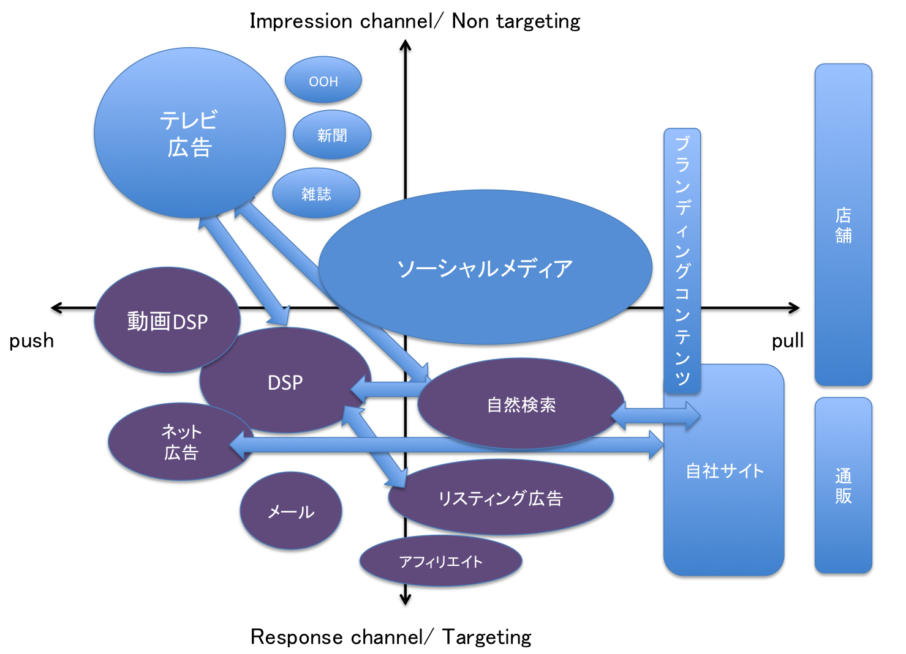

# ビックデータ入門

## 分析アプリケーション

* 影響度分析アプリケショーン
* 推奨リスト生成アプリケーション
* 予測アプリケーション
* 洞察アプリケーション

## データ・ドリブンな組織

* デジタルCMO(IT×経営)：ビジネスデザイン
* データサイエンティスト：分析の方向性を決める
* アプリケーションスペシャリスト：分析アプリケーションを選定する
* ITビジネスアーキテクト：どの問題解決をするかを決める

## データ・ドリブン体制の構築方法

①自社サイトを継続的コミュニケーションのハブとして、そこでのアクティビティをスコア化することで各チャネルに還元すること

②広告流入による、インタラクションコンバージョンの活性化を軸として、初回接触からコンバージョンまでの設定やクリエイティブコントロールを中心としてマーケティング全体にフィードする広告中心型

③　①＋②のハイブリッド型

## トリプルメディア

* ペイドメディア（paid media）= 「関心を作る」
マス4媒体(新聞・雑誌・テレビ・ラジオ)、web広告
* オウンドメディア（owned media）=「理解を促す」
自社が保有しているmディア
* アーンドメディア(earned media) =「共感を得る」
ブログやソーシャルメディア

## アトリビューション（リ・アロケーション）

### トータルアトリビューション概要図

