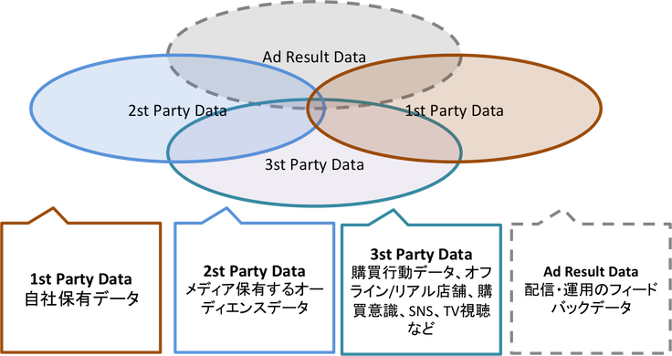

# DMPまとめ

## DMP(Data Management Platform)とは？

データを管理するプラットフォーム、
ユーザの状態を把握して、ユーザに適切な広告メッセージを送ったり、適切なタイミングで広告配信を行うことができる。
（ワントゥワンマーケティングを実現できる）

### デジタルマーケティングとは？

「デジタル施策によって得られるデータを活用して、マス、メディアを含めたマーケティングを最適化すること」

### PrivateDMPとPublicDMP

DMPには、以下の２種類が存在する。

 * __Public DMP__  
	広告配信対象となる、オーディエンスデータを販売するもの  
　		→　広告配信のためのDMP（データセラ）

 * __Private DMP__  
	企業が自社で保有している顧客及び将来の顧客の行動をデータベース化したもの  
　		→　広告配信も含むもっと多くのマーケティング施策を最適化するためのDMP

### DMPの処理フェーズ

DMPの機能として大きく分けて３つのフェーズに分けることができる  
①蓄積  
オーディエンスデータ（OD）、会員データ、閲覧データなどをデータマート化する  

②分類  
①で蓄積されたデータをマーケティング用途により、セグメント化する  

③配信  
②でセグメント化されたユーザに対して、各チャネル（ディスプレイ広告、メール配信、プッシュ通知など）を利用して、広告配信を行う。

### DMPの7要素

DMPの処理を詳細すると以下の7つがある。  

1. 顧客ID、訪問クッキー、会員ID、SNS-IDなどを統合する (①蓄積)
2. 統合されたデータを分析し、クラスタリングを生成する  (②分類)
3. 生成したクラスターを連携するツールにデータをフィードないし交換する (②分類)
4. 生成したクラスターに属するユーザデータを可視化する (②分類)
5. 特定ユーザと類似的に関連づけられるユーザに対象を拡張する  (②分類)
6. ユーザセグメントを最適化し、セグメントごとのメッセージを最適化する  (②分類, ③配信)
7. ユーザデータを広告配信に利用して、かつ広告配信の反応によってデータの精度を高める (③配信)

#### 1. ID統合

企業サイト等で持っている、ユーザIDを統合する。サイトごとに散らばっているクッキーID等を統合してユーザを一意にすることが必要となる。

#### 2. データ分析→クラスタリング

一元化したデータを様々な仕様でクラスタリングする。

#### 3. マーケティングツール用にデータをつなぐ

クラスタリングしたデータをマーケティングツール（例えば、「キャンペーン管理ツール」、「実行ツール」）などにつなぎ、ユーザとのコミュニケーションを設計する

#### 4. ユーザデータの可視化

クラスタごとのユーザデータは常に可視化されており、レポートされている必要がある。
※データの見方は、「インフィグラフィック（情報、データの可視的表現）」を研究する必要がある

#### 5. ユーザ拡張の技術

オーディエンスターゲティングには、「オーディエンス拡張」がある。
例えば、“認知“させるには、
「できるだけ多くの対象者に認知させる」から
今後のマーケティングは「まだ認知していないが、認知したら顧客となる潜在的なユーザを見つけ出す」
にシフトしていく。

#### 6. ユーザごにメッセージを最適化

セグメントされたデータごとに、ユーザごとに、メッセージを自動生成する
この作業は、考えている以上に難しい
（テキスト広告ならまだしも、画像、動画が主流となっているため、コンテンツをルールベースにPDCAを回し試すしかない）

## DMPが管理するデータ

### オーディエンスデータ(AD)の種類

* __1st Party Data__  
自社が保有しているデータ(自社データ)  (主に広告主が該当することが多い?） 
例：カメラメーカー`1ヶ月でカメラを購入する年齢層は40代が40%, 1月のカメラの購入数は女性の割合が20%Upとなる`

* __2st Party Data__  
メディア（広告枠を提供する側）が保有するデータ（オーディエンスデータ）  
例：`１時間前にamazonジョップのページをみた,ショップ遷移には至らなかった,javariにショップ遷移した履歴がある`

* __3st Party Data__   
他社が保有しているデータ(外部データ)  
購買行動データ、オフライン・リアル店舗、購買意識データ、SNSデータ、TVなど  
例：`外資系企業勤務,男性,都内在住`

* __Ad Result Data__  
広告配信の結果で得られた、広告効果が高いオーディエンスデータ。今後、広告代理店(ASP)が保有するであろうデータ。

### DMP別のデータの種類
 * Public DMP  
 サイトの閲覧履歴、検索ワード、購買データ、性別・年代等の属性データ、オフラインでのポイント利用履歴、天気、ニュース、TV番組の情報
 * Private DMP  
CRMデータ（顧客情報）、自社サイトでの細かい行動データ

## 広告からみたDMP

### リターゲティングとの違い

リターゲティングとは、サイト訪問経験があるユーザをターゲットとして広告配信を実施して、再度訪問を訴求する活動。  
一方で、DMPリターゲティングに限らず、認知・欲求・行動のどのプロセスにも効果を与える、ターゲティングデータを抽出することができる。

### 分析をページビュー(PV)からユニークユーザ（UU）へ

UUのユーザカテゴリ

 * 新規
 * リピーター（購入前）
 * リピーター（購入済み）
 * サイトカテゴリに含まれるかどうか

### セグメント化されたユーザの重なりを把握する

### 重複の排除

## メディアからみたDMP

* メディアのDMP導入の利点
	* メディア分析をオーディエンス単位で行う
 	* オーディエンスデータの提供

## 広告主からみたDMP

* 広告節のDMP導入の利用方法
	* 自社データの管理、セグメント化
	* 外部オーディエンスデータの購入

### セグメント化

執筆中。。。。。。。
ここは重要！！！

##### (A)趣味の軸でセグメント化

##### (B)モチベーションの軸でセグメント化

## 広告主がDMPを使用する７Step

1. Private DMPの構築
2. Private DMPへのデータ保存
3. 外部DMPとのデータ連携
4. 外部データとの分析
5. セグメント分割
6. 広告配信連携
7. 広告配信結果フィードバック

## Private DMP and Private DSP

今後の業界の展望
以下のプレイヤーがデータ競争を行う。

* 広告主
* 広告代理店
* メディア

広告主は、自社で高速のフォードバックを得て、マーケティングに反映したい。
しかし、広告代理店経由のDSPでは、フォードバックスピードは遅く、データを取扱うことが困難である。（そもそも、自社でお金を出して広告を出しているので、その成果データを広告代理店、DSPに吸い取られるのは、納得いかなくなるはず）
そのため、広告主もPrivateDSPを持つようになる。

## 今後の展望

### DMPを取り巻くアクターの変化

* データセラDMP
* プライベートDMP
* DMP最適化のインフラ
* BIツール
* SaaS型DMP

## 参考文献

* 「顧客を知るためのデータマネジメントプラットフォーム DMP入門 」
* 「広告ビシネス 次の10年」  
http://books.google.co.jp/books?id=ISsfBAAAQBAJ&pg=PA53&lpg=PA53&dq=%E3%82%BB%E3%82%AB%E3%83%B3%E3%83%89%E3%83%91%E3%83%BC%E3%83%86%E3%82%A3%E3%83%87%E3%83%BC%E3%82%BF&source=bl&ots=8hKt0G92Cx&sig=ffIKxU97JplG4hu54kvqbdBjOOw&hl=ja&sa=X&ei=hDFaVNOeJ8f98AWEwIG4AQ&ved=0CGIQ6AEwCQ#v=onepage&q=%E3%82%BB%E3%82%AB%E3%83%B3%E3%83%89%E3%83%91%E3%83%BC%E3%83%86%E3%82%A3%E3%83%87%E3%83%BC%E3%82%BF&f=false

* DMP（データマネジメントプラットフォーム）を徹底解説した、IABの白書をまとめてみる  
http://www.admarketech.com/2012/11/dmp-iab.html

* DMP（データマネジメントプラットフォーム）の基礎知識  
http://matome.naver.jp/odai/2136516923828199801

* DMP勉強会  
http://www.slideshare.net/shoho/dmpss-35555981?qid=404b57a8-4a88-48f9-9523-bcd909a0e1a4&v=default&b=&from_search=3

* DMP解説　仕組みと役割  
http://www.xlisting.co.jp/marketing-x/adtechnology/marketing/structure-and-roll-of-dmp

