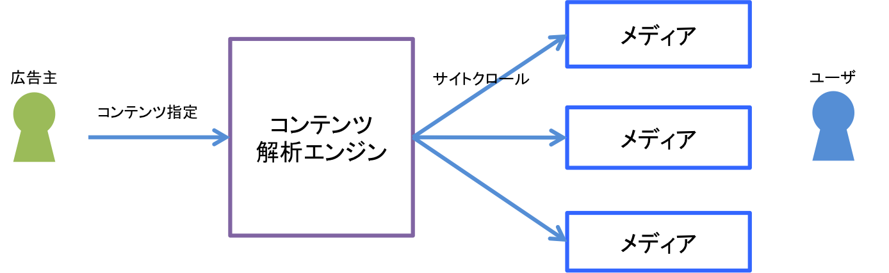
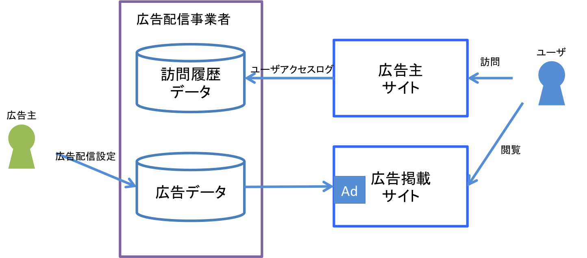

#アドテクノロジー入門

## 広告の種類

* リスティング広告
* アドネットワーク広告
* DSP広告
* アフィリエイト広告
* 動画広告
* ソーシャルメディア広告
* ネイティブ広告
* メール広告
* バナー広告（純広告）
* RSS広告
* リワード広告

http://markehack.jp/internet-advertising-types/

## ターゲティング手法

* コンテンツターゲティング
* リターゲテイング
* 行動ターゲティング
* リターゲティング拡張
* オーディエンスターゲティング
* ダイナミックリターゲティング

### コンテンツターゲティング

``コンテツマッチ、コンテンツ連動型広告``  
コンテンツの内容に合わせて合致する広告を配信する。

### リターゲティング

一度訪問したユーザをターゲットにして、メディアに訪問時に、広告配信を行う手法。

### 行動ターゲティング

ユーザのインターネット上の行動に着目した手法。
ユーザの過去の行動履歴などアクセスログを解析して、ユーザをカテゴリ化する。
データから趣味、嗜好、興味関心を読み解き、広告配信を行う。
（※手法は広告事業者によってことなる）

### リターゲティング拡張

自社への訪問済みのユーザの行動履歴を教師データとして、類似するユーザをターゲットとして、広告配信を行う手法。  

##### リタゲ拡張に必要な要素

1. インターネットユーザのアクセスログから行動特性・趣味嗜好を分析する技術
2. より多くのインターネットユーザの行動特性・趣味嗜好データを保有していること
3. 広告主サイト来訪ユーザとその他ユーザの行動特性の関連性を分析する技術

### オーディエンスターゲティング

``DMP, リタゲ、行動ターゲティング``  
※特定の技術・手法ではなく、観点、考えかたを表している。  
「オーディエンス」=「プロモーション対象のユーザ」を見極めるために、あらゆるデータを使って、ターゲティングを行うこと。
膨大なビックデータから興味関心、嗜好を読み解き、よりきめ細かくユーザを特定して広告配信を行う。  
ターゲティングデータの収集には、__DMP__が注目されている。

###ダイナミックリターゲティング

サイト内でのユーザ行動（購入履歴、商品閲覧履歴など）によりターゲティングをする手法。  
例えば、一度みたAmazonの商品一覧等を動的にバナーを出し分ける方法などが一般的 
http://www.ever-rise.co.jp/adtech-blog/criteo.html 

 
